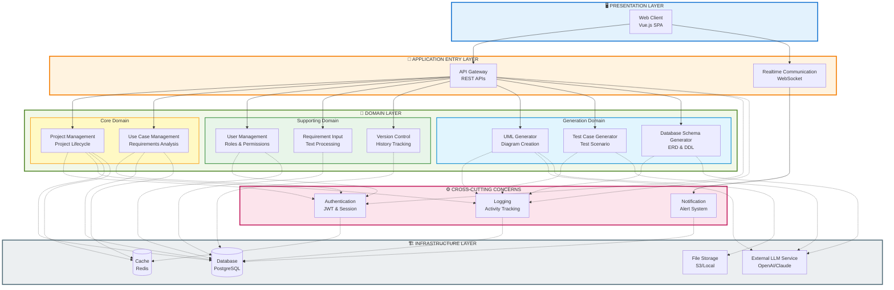

# MODULE VIEW - HỆ THỐNG TỰ ĐỘNG HÓA PHÂN TÍCH VÀ THIẾT KẾ PHẦN MỀM

## 1. GIỚI THIỆU

**Module View** thể hiện cấu trúc phân rã logic của hệ thống thành các module chức năng theo **Module Decomposition Style**. Đây là một architectural view thuộc nhóm **Static Structure**, tập trung vào:

- **Logical modules**: Nhóm các trách nhiệm (responsibilities) liên quan
- **Module dependencies**: Quan hệ "sử dụng" giữa các module (A → B nghĩa "A sử dụng B")
- **Separation of concerns**: Tách biệt các tầng Presentation, Application, Domain, Infrastructure

**Module View KHÔNG mô tả**:
- Runtime behavior (process, threads)
- Deployment details (servers, containers, ports)
- Physical implementation (classes, files)

Module View giúp hiểu rõ cấu trúc logic, quản lý dependencies, và đảm bảo maintainability của hệ thống.

---

## 2. MODULE VIEW DIAGRAM

---

## 3. CHI TIẾT CÁC MODULE

### 3.1. PRESENTATION LAYER

**Module: Web Client (Vue.js)**
- **Trách nhiệm**: Giao diện người dùng cuối, tương tác với backend qua API Gateway và WebSocket
- **Công nghệ**: Vue.js Single Page Application
- **Dependencies**: Chỉ phụ thuộc vào Application Entry Layer
- **Không chứa**: Business logic, database access

---

### 3.2. APPLICATION ENTRY LAYER

**Module: API Gateway**
- **Trách nhiệm**: 
  - Định tuyến HTTP requests đến các Domain Modules
  - Điều phối (orchestrate) các nghiệp vụ phức tạp
  - Request validation và response formatting
- **Dependencies**: Tất cả Domain Modules, Cross-cutting Modules

**Module: Realtime Communication**
- **Trách nhiệm**: 
  - Quản lý WebSocket connections
  - Push notifications realtime
  - Broadcast system events
- **Dependencies**: Notification Module

---

### 3.3. CROSS-CUTTING CONCERNS

**Module: Authentication**
- **Trách nhiệm**: JWT-based authentication, session management, authorization checks
- **Reusable by**: API Gateway, Core Domain, Supporting Domain
- **Dependencies**: Cache (session storage)

**Module: Logging**
- **Trách nhiệm**: Activity tracking, audit logs, error logging
- **Reusable by**: Tất cả các Domain Modules, API Gateway
- **Dependencies**: Database (log persistence)

**Module: Notification**
- **Trách nhiệm**: Alert system, email/push notifications, notification queue
- **Reusable by**: Realtime Communication, Domain Modules
- **Dependencies**: Database (notification history)

---

### 3.4. DOMAIN LAYER

#### 3.4.1. Core Domain (Nghiệp vụ cốt lõi)

**Module: Project Management**
- **Trách nhiệm**: 
  - Quản lý vòng đời dự án phần mềm
  - Metadata, status tracking
  - Project collaboration
- **Dependencies**: Database, Cache, Authentication, Logging

**Module: Use Case Management**
- **Trách nhiệm**: 
  - Phân tích và quản lý use cases
  - Actor identification, scenario management
  - Use case relationships (include, extend)
- **Dependencies**: Database, Cache, Authentication

---

#### 3.4.2. Supporting Domain (Hỗ trợ Core Domain)

**Module: User Management**
- **Trách nhiệm**: 
  - Quản lý user accounts, roles, permissions
  - Profile management
- **Dependencies**: Database, Authentication

**Module: Requirement Input**
- **Trách nhiệm**: 
  - Text processing của requirements tự nhiên
  - Parsing và normalization
  - Requirement classification
- **Dependencies**: Database

**Module: Version Control**
- **Trách nhiệm**: 
  - History tracking của artifacts (UML, test cases, schema)
  - Versioning strategy
  - Rollback support
- **Dependencies**: Database

---

#### 3.4.3. Generation Domain (Tự động sinh tài liệu)

**Module: UML Generator**
- **Trách nhiệm**: 
  - Tự động sinh Use Case Diagram, Class Diagram, Sequence Diagram
  - Sử dụng LLM để phân tích requirements
  - Export UML dưới định dạng PlantUML, XMI
- **Dependencies**: External LLM Service, File Storage, Logging

**Module: Test Case Generator**
- **Trách nhiệm**: 
  - Tự động sinh test scenarios từ use cases
  - Test data generation
  - Coverage analysis
- **Dependencies**: External LLM Service, Logging

**Module: Database Schema Generator**
- **Trách nhiệm**: 
  - Tự động sinh ERD từ class diagram
  - DDL script generation (CREATE TABLE, constraints)
  - Database normalization suggestions
- **Dependencies**: External LLM Service, Logging

---

### 3.5. INFRASTRUCTURE LAYER

**Module: Database**
- **Công nghệ**: PostgreSQL
- **Trách nhiệm**: Persistent storage cho entities, logs, notifications
- **Được sử dụng bởi**: Domain Modules, Cross-cutting Modules (qua abstraction/repository pattern)

**Module: Cache**
- **Công nghệ**: Redis
- **Trách nhiệm**: Session storage, temporary data, performance optimization
- **Được sử dụng bởi**: Authentication, Project, Use Case

**Module: File Storage**
- **Công nghệ**: AWS S3 hoặc Local Storage
- **Trách nhiệm**: Lưu trữ generated UML files, exported documents
- **Được sử dụng bởi**: UML Generator

**Module: External LLM Service**
- **Công nghệ**: OpenAI GPT-4 hoặc Claude API
- **Trách nhiệm**: Natural language processing, intelligent generation
- **Được sử dụng bởi**: Generation Domain (UML, Test Case, DB Schema)

---

## 4. QUAN HỆ PHỤ THUỘC (DEPENDENCIES)

### 4.1. Quy tắc phụ thuộc

1. **One-directional dependencies**: Dependencies chỉ một chiều từ trên xuống
   - Presentation → Application Entry
   - Application Entry → Domain
   - Domain → Infrastructure (thông qua abstraction)

2. **Dependency Inversion Principle**: 
   - Domain Modules KHÔNG phụ thuộc trực tiếp vào Infrastructure
   - Sử dụng Repository Pattern/Interface để abstract database access
   - Infrastructure implements interfaces được định nghĩa trong Domain

3. **Cross-cutting reusability**:
   - Authentication, Logging, Notification có thể được dùng bởi nhiều modules
   - Sử dụng dashed arrows (-.->)  để thể hiện cross-cutting concerns

### 4.2. Giải thích các mũi tên

- **Solid arrows (-->)**: Direct module dependency (A sử dụng B)
- **Dashed arrows (-.->)**: Infrastructure usage hoặc cross-cutting concerns (loose coupling)

---

## 5. ĐÁNH GIÁ KIẾN TRÚC

### 5.1. Ưu điểm

✅ **Separation of Concerns**: Tách biệt rõ ràng Presentation, Application, Domain, Infrastructure

✅ **Dependency Management**: Dependencies một chiều, dễ quản lý và test

✅ **Reusability**: Cross-cutting modules có thể tái sử dụng

✅ **Maintainability**: Module decomposition giúp dễ dàng mở rộng từng module độc lập

✅ **Testability**: Domain logic tách biệt khỏi Infrastructure, dễ unit test

### 5.2. Trade-offs

⚠️ **Complexity**: Nhiều layers có thể tăng độ phức tạp cho hệ thống nhỏ

⚠️ **Performance**: Abstraction layers có thể ảnh hưởng performance (cần caching)

---

## 6. KẾT LUẬN

Module View thể hiện cấu trúc phân rã logic của hệ thống thành **5 layers** và **13 modules chính**:

- **Presentation Layer**: Web Client (Vue)
- **Application Entry Layer**: API Gateway, Realtime Communication
- **Cross-cutting Layer**: Authentication, Logging, Notification
- **Domain Layer**: 
  - Core Domain: Project, Use Case
  - Supporting Domain: User, Requirement Input, Version
  - Generation Domain: UML, Test Case, Database Schema
- **Infrastructure Layer**: Database, Cache, File Storage, External LLM Service

Kiến trúc tuân thủ **Layered Architecture Pattern** với dependencies một chiều, đảm bảo **loose coupling** và **high cohesion**. Hệ thống dễ dàng mở rộng, bảo trì, và testing.

---

## 7. TÀI LIỆU THAM KHẢO

- Bass, L., Clements, P., & Kazman, R. (2021). *Software Architecture in Practice* (4th ed.). Addison-Wesley.
- Rozanski, N., & Woods, E. (2011). *Software Systems Architecture: Working with Stakeholders Using Viewpoints and Perspectives* (2nd ed.). Addison-Wesley.
- Martin, R. C. (2017). *Clean Architecture: A Craftsman's Guide to Software Structure and Design*. Prentice Hall.
